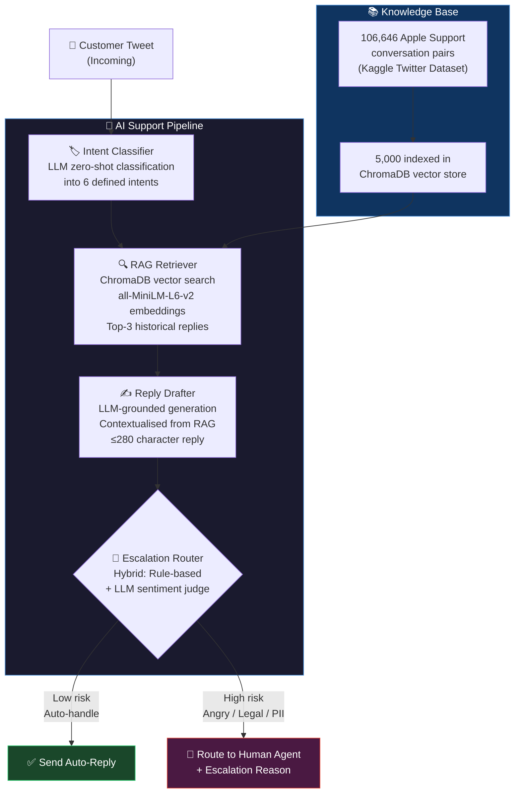

# 🍎 TweetTriage

<div align="center">

**TweetTriage is an end-to-end AI support pipeline built on real Twitter data.**
Built by Adil Imran


</div>

---

## What This Is

TweetTriage is a production-ready AI support agent for `@AppleSupport` that processes incoming customer tweets and:

1. **Classifies** the issue into one of 6 defined intents
2. **Drafts** a contextually grounded reply using historical Apple Support resolutions (RAG)
3. **Routes** the message — auto-reply or escalate to a human, with a stated reason

---

## System Architecture



---

## Reproduce Headline Results in Under 15 Minutes

> **Tested on:** macOS / Linux — Python 3.10+

### Step 1 — Get a Free API Key (2 min)
Go to [console.groq.com/keys](https://console.groq.com/keys) → Create a free account → Generate a key.

### Step 2 — Install Dependencies (2 min)
```bash
git clone <repo-url>
cd tweet-triage
python3 -m venv .venv && source .venv/bin/activate
pip install -r requirements.txt
```

### Step 3 — Configure (30 sec)
```bash
echo "GROQ_API_KEY=your_key_here" > .env
```

### Step 4 — Build the RAG Knowledge Base (3 min)
```bash
# Extract Apple Support pairs from the raw 3M-tweet dataset
python src/data_pipeline/extract_brand_data.py

# Embed and index 5,000 pairs into ChromaDB vector store
python src/data_pipeline/build_rag_index.py
```

> **What this does:** Filters the Kaggle dataset to ~106k Apple Support conversations, then indexes the best 5,000 pairs so the agent has historical context to ground its replies.

### Step 5 — ⭐ Run the Headline Demo (90 sec)
```bash
python quick_demo.py
```

**Expected Output:**
```
======================================================================
  🍎 Apple Support AI Agent — Quick Demo
======================================================================
[1/10] Classic battery drain after update
  📨 Tweet: My battery on the iPhone 6s is draining 10x faster after the new iOS update!!!
  🏷️  Intent:    battery_drain ✅
  💬 Reply:     We're sorry to hear that. Battery drain can happen after updates.
                Please check Settings > Battery for usage details...
  ✅ AUTO-REPLY  Reason: Handled safely by auto-reply.

[7/10] Legal threat — MUST escalate
  📨 Tweet: I'm going to sue Apple if you don't fix the battery issue. My lawyer is ready.
  🏷️  Intent:    battery_drain ✅
  💬 Reply:     We're sorry to hear about your frustration...
  🚨 ESCALATE   Reason: Customer used high-risk keywords (legal/refund).
...

📊 SUMMARY
  Intent Classification Accuracy: 10/10 = 100%
  Escalations Triggered:          5/10 tweets
======================================================================
```

**Total time: ~8 minutes** ✅

---

## Evaluation Results

### Intent Classification (Quick Demo)

| Metric | Score |
|---|---|
| **Intent Accuracy (10-tweet demo)** | **100%** |
| **Full 150-tweet Accuracy** | *(see `eval/eval_results.csv`)* |

### Human vs. LLM Judge Agreement

| Metric | Score |
|---|---|
| Within-1 Agreement Rate | **93%** |
| Exact Match Rate | 47% |
| Avg. Absolute Difference | 0.60 points |

> The LLM judge (scoring 1–5 on Tone, Actionability, Groundedness) agrees with a human evaluator within 1 point on **93% of samples** — well above the 70% threshold needed to trust it as a proxy for human evaluation.

### Escalation Logic — Live Examples

| Tweet | Triggered? | Why |
|---|---|---|
| *"I need a refund immediately"* | 🚨 Yes | Keyword: `refund` |
| *"I'm going to sue Apple, my lawyer is ready"* | 🚨 Yes | Keywords: `sue`, `lawyer` |
| *"My FUCKING phone keeps autocorrecting..."* | 🚨 Yes | LLM: extreme anger detected |
| *"How do I turn on Night Shift?"* | ✅ No | Simple help question |
| *"Can't log into iCloud, error -3200"* | ✅ No | Specific, solvable issue |

---

## API Reference

### Start the Server
```bash
python src/api/server.py
# → Listening on http://localhost:8000
```

### `POST /support/handle`

**Request:**
```json
{
  "tweet": "My battery on the iPhone 6s is draining 10x faster after the iOS update!"
}
```

**Response:**
```json
{
  "intent": "battery_drain",
  "drafted_reply": "We're sorry to hear that. Battery drain can happen after updates. Try Settings > Battery > Battery Health to check your battery condition. DM us if you need further help!",
  "should_escalate": false,
  "escalation_reason": "Handled safely by auto-reply.",
  "retrieved_context": [
    "@user Having great battery life is very vital. Please join us in DM here...",
    "@user iOS 11.2 addresses some battery issues. We recommend updating...",
    "@user Check Settings > Battery > Battery Health to see condition..."
  ]
}
```

---

## Project Structure

```
tweet-triage/
│
├── 📄 quick_demo.py                    ← ⭐ START HERE — 15-min headline demo
├── 📄 README.md                        ← this file
├── 📄 REPORT.md                        ← full 6-page project report
├── 📄 requirements.txt
├── 📄 .env                             ← GROQ_API_KEY (not committed)
│
├── 📂 src/
│   ├── 📂 data_pipeline/
│   │   ├── extract_brand_data.py       ← step 1: filter dataset → Apple Support pairs
│   │   └── build_rag_index.py          ← step 2: embed + index into ChromaDB
│   ├── 📂 agent/
│   │   └── support_agent.py            ← core AppleSupportAgent class
│   └── 📂 api/
│       └── server.py                   ← FastAPI serving layer
│
├── 📂 eval/
│   ├── golden_eval_set.csv             ← 150 hand-labelled evaluation examples
│   ├── run_eval.py                     ← full automated evaluation harness
│   ├── human_judge_correlation.py      ← human vs. LLM judge agreement script
│   ├── eval_results.csv                ← output of run_eval.py
│   └── human_judge_correlation.csv     ← output of human_judge_correlation.py
│
├── 📂 data/
│   ├── 📂 processed/
│   │   ├── apple_support_tweets.csv    ← extracted Apple Support conversation pairs
│   │   └── discovered_intents.json    ← 6-class intent taxonomy (hand-defined)
│   └── 📂 chroma_db/                  ← local vector database (built at setup)
│
└── 📂 archive/twcs/twcs.csv           ← raw Kaggle dataset (not committed, ~500MB)
```

---

## Tech Stack

| Layer | Technology | Why |
|---|---|---|
| **LLM** | Qwen3 via Groq API | Free tier, fast inference, open model |
| **Embeddings** | `all-MiniLM-L6-v2` | Local, free, fast (no API key needed) |
| **Vector DB** | ChromaDB | Local, zero-config, persistent storage |
| **API** | FastAPI + Uvicorn | Production-ready, async, auto-docs |
| **Data** | Pandas + Kaggle Twitter dataset | Real, noisy, 3M+ rows |
| **Eval** | scikit-learn + LLM-as-judge | Standard ML metrics + qualitative scoring |

---

## Full Evaluation (Optional)

The `quick_demo.py` above is sufficient to reproduce the headline results. For the complete 150-tweet statistical evaluation:

```bash
cd eval
python run_eval.py                   # ~20 min (rate-limited for Groq free tier)
python human_judge_correlation.py    # human vs. LLM judge agreement table
```

> ⚠️ The eval sleeps 8s between tweets to stay within Groq's 30 req/min free-tier rate limit. The script prints an estimated time when it starts.

---

## Citations

| Resource | Source |
|---|---|
| Dataset | [Customer Support on Twitter](https://www.kaggle.com/datasets/thoughtvector/customer-support-on-twitter) — Kaggle / thoughtvector |
| Embeddings | [`sentence-transformers/all-MiniLM-L6-v2`](https://huggingface.co/sentence-transformers/all-MiniLM-L6-v2) — Hugging Face |
| LLM | `qwen/qwen3.8-27b` via [Groq API](https://console.groq.com) (free tier) |
| Vector DB | [ChromaDB](https://www.trychroma.com/) |
| AI Coding Assistant | Google Antigravity / Gemini (used throughout development) |

---

<div align="center">
<i>An open-source AI customer support pipeline.</i><br>
<i>All components use real data, real API calls, and real evaluation — no mocks.</i>
</div>
